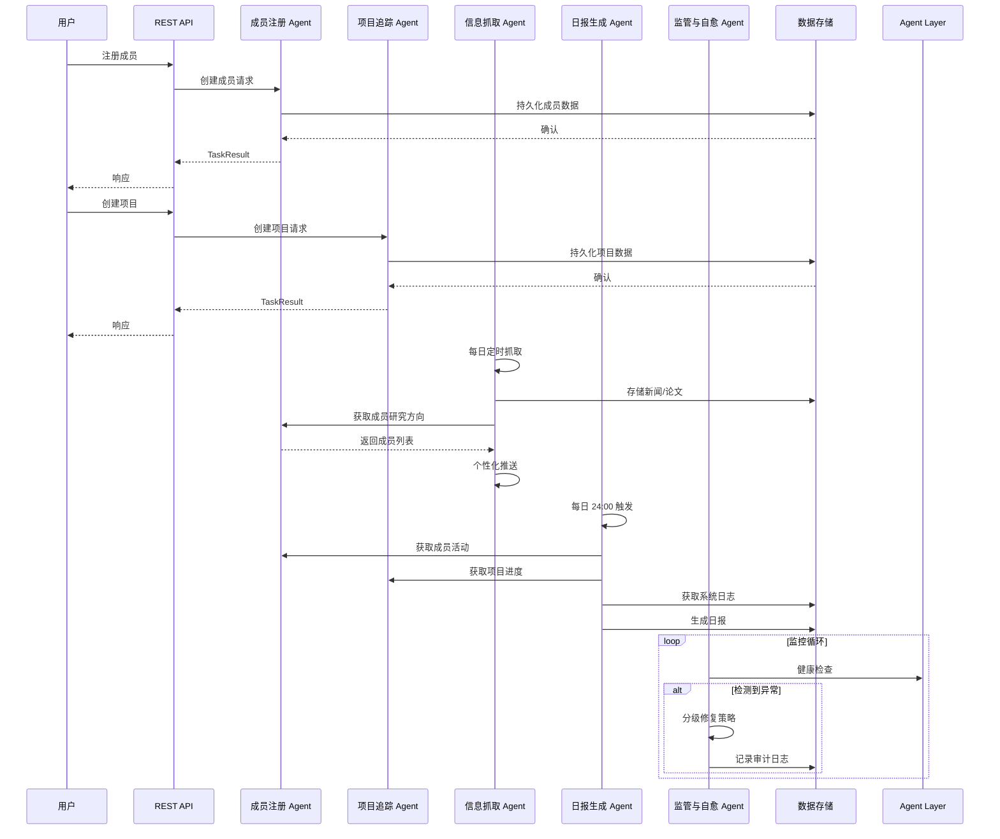

# 科研团队管理多智能体系统 - 架构设计

## 1. 系统概述

本系统是基于现代 Agent 框架构建的科研团队全生命周期管理智能体系统，采用模块化微服务架构，各 Agent 独立运行，通过 API 通信协作。

## 2. 系统架构图

```mermaid
graph TB
    subgraph "Client Layer"
        Web[Web UI]
        CLI[CLI 工具]
        API[REST API]
    end

    subgraph "Agent Layer"
        MA[监管与自愈 Agent<br/>Monitor & Self-healing]
        MA2[成员注册 Agent<br/>Member Registration]
        MA3[项目追踪 Agent<br/>Project Tracking]
        MA4[信息抓取 Agent<br/>Info Scraper]
        MA5[日报生成 Agent<br/>Daily Report]
    end

    subgraph "Core Services"
        TaskQueue[任务队列<br/>Task Queue]
        Memory[记忆模块<br/>Memory Module]
        Skills[技能注册中心<br/>Skills Registry]
        RAG[RAG 管道<br/>RAG Pipeline]
    end

    subgraph "Data Layer"
        SQLite[(SQLite 数据库)]
        JSON[(JSON 文件存储)]
        VectorDB[(向量数据库<br/>Chroma/FAISS)]
    end

    Web --> API
    CLI --> API
    API --> Agent Layer

    MA --> MA2
    MA --> MA3
    MA --> MA4
    MA --> MA5

    Agent Layer --> Core Services
    Core Services --> Data Layer
```

## 3. Agent 交互时序图



## 4. 目录结构

```
research-team-agents/
├── src/
│   ├── agents/                  # Agent 实现
│   │   ├── __init__.py
│   │   ├── base_agent.py       # Agent 基类
│   │   ├── member_agent.py     # 成员注册 Agent
│   │   ├── project_agent.py    # 项目追踪 Agent
│   │   ├── scraper_agent.py    # 信息抓取 Agent
│   │   ├── report_agent.py     # 日报生成 Agent
│   │   └── monitor_agent.py    # 监管与自愈 Agent
│   ├── core/                    # 核心服务
│   │   ├── __init__.py
│   │   ├── task_result.py      # TaskResult 定义
│   │   ├── memory.py           # 记忆模块
│   │   ├── skills.py           # 技能注册中心
│   │   └── rag.py              # RAG 管道
│   ├── models/                  # 数据模型
│   │   ├── __init__.py
│   │   ├── member.py           # 成员模型
│   │   ├── project.py          # 项目模型
│   │   └── news.py             # 新闻/论文模型
│   ├── storage/                 # 数据存储
│   │   ├── __init__.py
│   │   ├── sqlite_db.py        # SQLite 存储
│   │   └── json_store.py       # JSON 存储
│   ├── api/                     # API 层
│   │   ├── __init__.py
│   │   ├── main.py             # FastAPI 主入口
│   │   └── routes.py           # API 路由
│   └── utils/                   # 工具函数
│       ├── __init__.py
│       └── logger.py           # 日志工具
├── tests/                       # 测试
│   ├── __init__.py
│   ├── test_member_agent.py
│   └── test_project_agent.py
├── data/                        # 数据目录
│   ├── db/
│   └── reports/
├── config/                      # 配置
│   └── settings.py
├── TODO.md                      # 项目看板
├── README.md                    # 技术文档
├── requirements.txt             # 依赖
└── .env.example                 # 环境变量模板
```

## 5. 核心数据模型

### 成员模型 (Member)
```python
{
    "id": str,
    "name": str,
    "student_id": str,
    "email": str,
    "research_interests": List[str],
    "personal_website": Optional[str],
    "github": Optional[str],
    "created_at": datetime,
    "updated_at": datetime
}
```

### 项目模型 (Project)
```python
{
    "id": str,
    "name": str,
    "description": str,
    "members": List[str],  # member IDs
    "status": "active" | "archived",
    "milestones": List[Milestone],
    "last_updated": datetime,
    "created_at": datetime
}
```

### 里程碑模型 (Milestone)
```python
{
    "id": str,
    "name": str,
    "description": str,
    "due_date": datetime,
    "status": "pending" | "in_progress" | "completed",
    "completed_at": Optional[datetime]
}
```

## 6. 技术栈

- **Agent 框架**: LangChain / LangGraph
- **Web 框架**: FastAPI
- **数据库**: SQLite (主数据) + JSON (配置/缓存)
- **向量数据库**: Chroma / FAISS (预留)
- **任务调度**: APScheduler
- **HTTP 客户端**: httpx / requests
- **日志**: structlog
- **测试**: pytest

## 7. 扩展接口预留

### 7.1 Memory 模块
- 短期对话缓存
- 长期向量记忆 (Chroma/FAISS)

### 7.2 MCP 协议
- Model Context Protocol 服务端
- Model Context Protocol 客户端

### 7.3 Skills 注册中心
- 动态加载工具函数
- 邮件发送
- 日历同步

### 7.4 RAG 管道
- 论文/文档嵌入
- 检索
- 重排序接口
