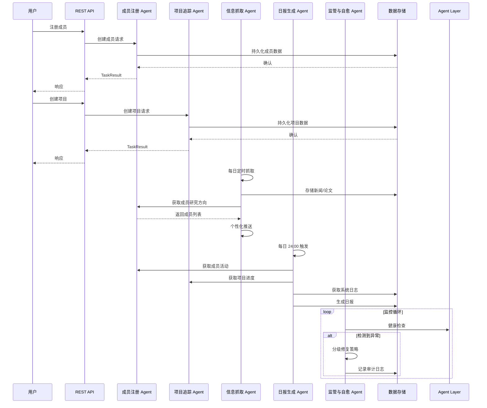

# 科研团队管理多智能体系统

基于现代 Agent 框架（LangChain/LangGraph）构建的科研团队全生命周期管理智能体系统。

## 系统架构图

```mermaid
graph TB
    subgraph "Client Layer"
        Web[Web UI]
        CLI[CLI 工具]
        API[REST API]
    end

    subgraph "Agent Layer"
        MA[监管与自愈 Agent<br/>Monitor & Self-healing]
        MA2[成员注册 Agent<br/>Member Registration]
        MA3[项目追踪 Agent<br/>Project Tracking]
        MA4[信息抓取 Agent<br/>Info Scraper]
        MA5[日报生成 Agent<br/>Daily Report]
    end

    subgraph "Core Services"
        TaskQueue[任务队列<br/>Task Queue]
        Memory[记忆模块<br/>Memory Module]
        Skills[技能注册中心<br/>Skills Registry]
        RAG[RAG 管道<br/>RAG Pipeline]
    end

    subgraph "Data Layer"
        SQLite[(SQLite 数据库)]
        JSON[(JSON 文件存储)]
        VectorDB[(向量数据库<br/>Chroma/FAISS)]
    end

    Web --> API
    CLI --> API
    API --> MA2
    API --> MA3

    MA -.-> MA2
    MA -.-> MA3
    MA -.-> MA4
    MA -.-> MA5

    MA2 --> Core Services
    MA3 --> Core Services
    MA4 --> Core Services
    MA5 --> Core Services

    SQLite --> Data Layer
    JSON --> Data Layer
    VectorDB --> Data Layer
```

## Agent 交互时序图



## 核心功能

### P0 - 核心数据管理
1. **成员注册 Agent** - 维护成员画像，支持 CRUD 操作
2. **项目追踪 Agent** - 记录项目全生命周期，追踪里程碑进度

### P1 - 情报采集与分发
3. **信息抓取 Agent** - 每日定时抓取 AI 领域热点新闻和 arXiv 论文

### P2 - 运维与自愈
4. **日报生成 Agent** - 每日自动汇总系统运行状态
5. **监管与自愈 Agent** - 监控 Agent 健康状态，执行分级修复策略

## 快速启动指南

### 环境要求
- Python 3.10+
- pip

### 安装步骤

1. 克隆项目
```bash
cd "d:\PyPrograms\LLM Agent"
```

2. 创建虚拟环境
```bash
python -m venv venv
venv\Scripts\activate
```

3. 安装依赖
```bash
pip install -r requirements.txt
```

4. 配置环境变量
```bash
cp .env.example .env
# 编辑 .env 文件，填入必要的配置
```

5. 初始化数据库
```bash
python -m src.storage.init_db
```

6. 启动 API 服务
```bash
python -m src.api.main
```

7. 启动监管 Agent（独立进程）
```bash
python -m src.agents.monitor_agent
```

## 环境变量配置模板

创建 `.env` 文件，内容如下：

```env
# 数据库配置
DATABASE_URL=sqlite:///data/db/research_team.db
JSON_STORAGE_PATH=data/json/

# API 配置
API_HOST=0.0.0.0
API_PORT=8000
DEBUG=true

# 日志配置
LOG_LEVEL=INFO
LOG_FILE=data/logs/app.log

# 信息抓取配置
SCRAPER_INTERVAL_HOURS=24
ARXIV_CATEGORIES=cs.AI,cs.LG,cs.CL
TECHCRUNCH_ENABLED=true
JIQIZHIXIN_ENABLED=true

# 项目追踪配置
STAGNATION_DAYS=7

# 日报配置
REPORT_TIME=24:00
REPORT_FORMAT=markdown
REPORT_OUTPUT_PATH=data/reports/

# 监管与自愈配置
MONITOR_INTERVAL_SECONDS=60
MAX_RETRIES=3
AUTO_RESTART_ENABLED=true

# 扩展模块配置（预留）
MEMORY_ENABLED=false
VECTOR_DB_TYPE=chroma
CHROMA_PATH=data/vectordb/
SKILLS_PATH=src/skills/
RAG_ENABLED=false
```

## 目录结构

```
research-team-agents/
├── src/
│   ├── agents/                  # Agent 实现
│   ├── core/                    # 核心服务
│   ├── models/                  # 数据模型
│   ├── storage/                 # 数据存储
│   ├── api/                     # API 层
│   └── utils/                   # 工具函数
├── tests/                       # 测试
├── data/                        # 数据目录
├── config/                      # 配置
├── TODO.md                      # 项目看板
├── ARCHITECTURE.md              # 架构设计
├── README.md                    # 技术文档
├── requirements.txt             # 依赖
└── .env.example                 # 环境变量模板
```

## 技术栈

- **Agent 框架**: LangChain / LangGraph
- **Web 框架**: FastAPI
- **数据库**: SQLite (主数据) + JSON (配置/缓存)
- **向量数据库**: Chroma / FAISS (预留)
- **任务调度**: APScheduler
- **HTTP 客户端**: httpx
- **日志**: structlog
- **测试**: pytest

## 开发指南

### 运行测试
```bash
pytest tests/
```

### 代码格式化
```bash
black src/
isort src/
```

### 代码检查
```bash
flake8 src/
mypy src/
```

## 扩展接口预留

### Memory 模块
- 短期对话缓存
- 长期向量记忆 (Chroma/FAISS)

### MCP 协议
- Model Context Protocol 服务端
- Model Context Protocol 客户端

### Skills 注册中心
- 动态加载工具函数
- 邮件发送
- 日历同步

### RAG 管道
- 论文/文档嵌入
- 检索
- 重排序接口

## 许可证

MIT License
